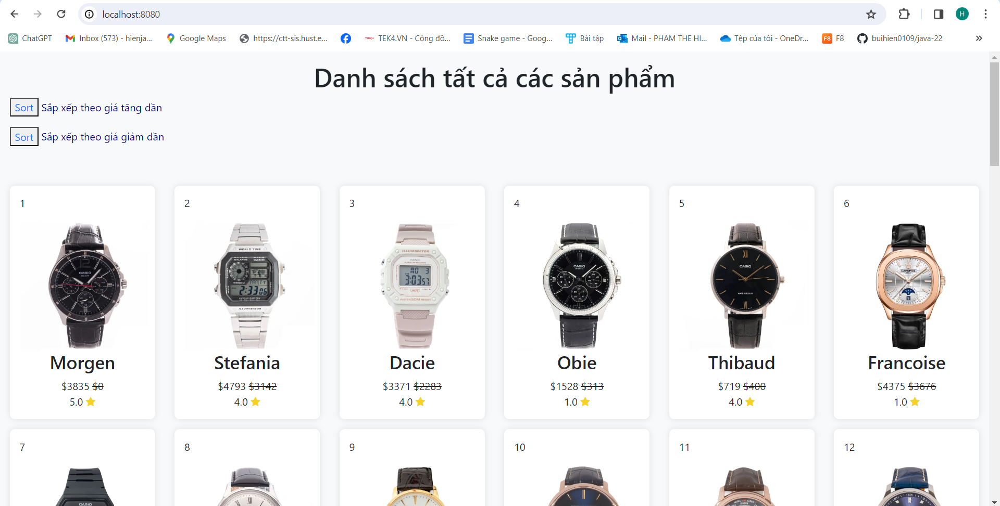
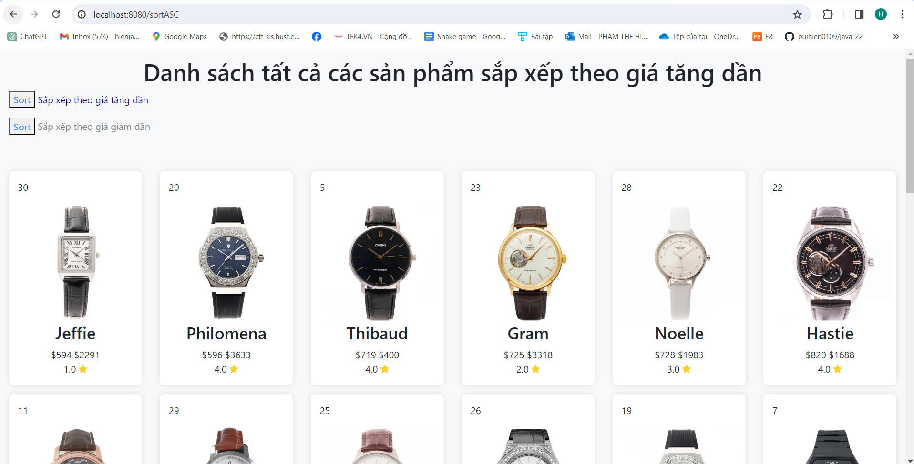
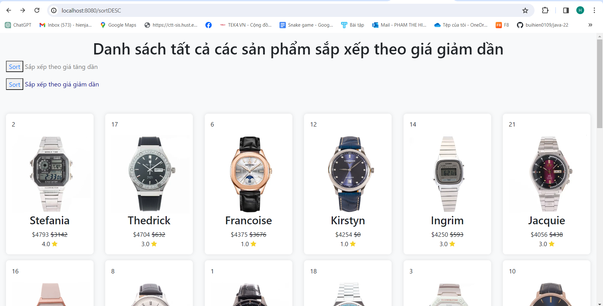
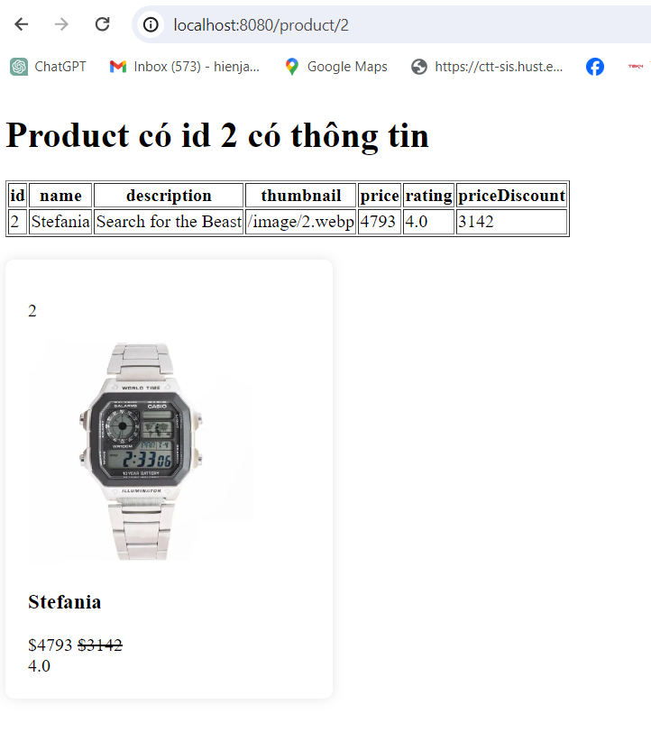

## Giới thiệu: 
Mini project: Giới thiệu đồng hồ đeo tay. 

## Tổng quan:
1. Trang chính
- Hiện hình ảnh, tên, giá... của sản phẩm
- Có 2 nút để sắp xếp sản phẩm theo giá
- Hình ảnh trang chính

2. Trang sắp xếp
  - Sắp xếp theo giá tăng dần

  - Sắp xếp theo giá giảm dần

3. Trang lấy từng sản phẩm theo id
- Có bảng thông số sản phẩm
- Hình ảnh từng sản phẩm

